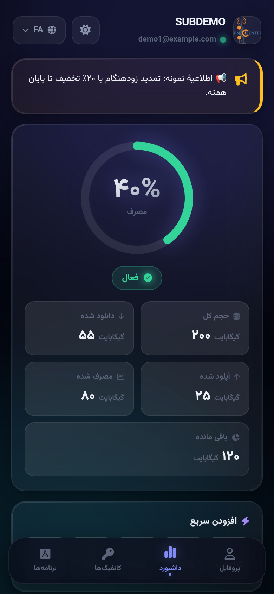
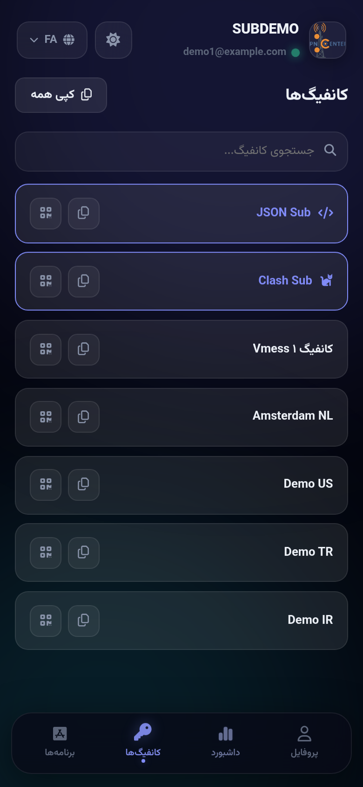
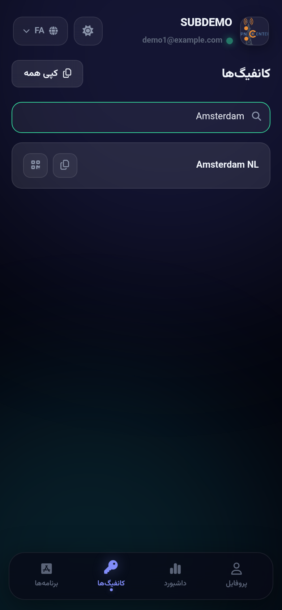
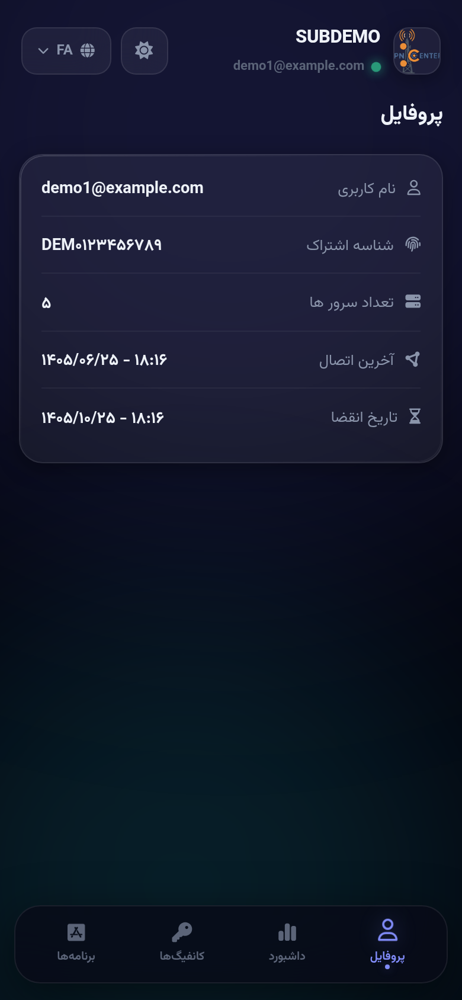
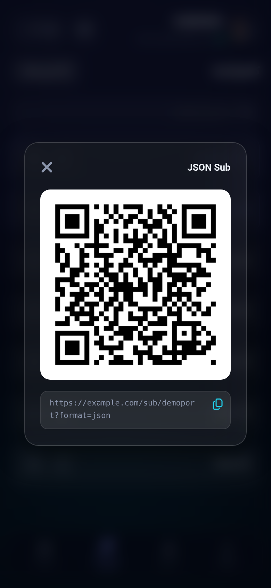
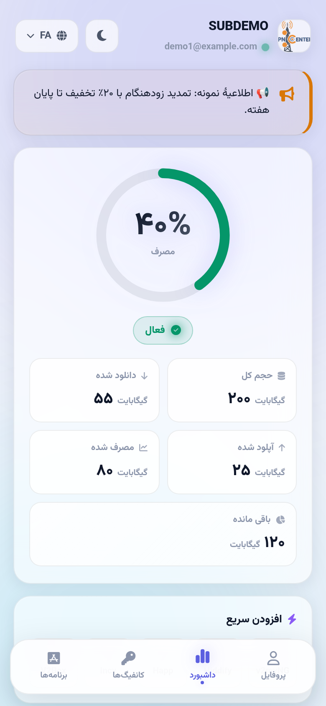

# Aurora Subscription — 3x-ui White-label Sub Page

A custom subscription page theme for **3x-ui** panels — "Aurora Glass" design.
RTL-first, 4 languages (فارسی / English / 中文 / Русский), fully white-label: no seller name, no support/renew buttons, no external services.

| | |
|---|---|
|  |  |
| Home (dark) — usage ring, expiry, IP/geo card | Configs — links, QR, quick rows |
|  |  |
| Live config search (filters as you type) | Profile — account info |
|  |  |
| QR modal (generated locally, no external service) | Home (light theme) |

## Files
- **`sub.html`** — production file. Drop it into your panel's custom subscription theme dir.
- **`demo.html`** — the same page rendered with fake data — open directly in a browser to preview.
- `shots/` — screenshots for this README.

## Features
- 🌌 **Aurora Glass design** — animated aurora background, glass cards, dark + light themes
- 🎯 **4 tabs** — Home / Configs / Apps / Profile
- ⚡ **Live config search** — box appears when you have more than 3 configs; filters instantly; JSON / Clash quick-copy rows
- 🌍 **Visitor IP & geo card** — shows the visitor's IP, country flag, and a protection-status banner; manual refresh button
- 📢 **Panel announce banner** — set an announcement in the panel; empty = auto-hidden
- 🟢 **Online dot** — pulsing green when the panel reports the user online
- 📊 **Usage ring + expiry countdown** — Persian digits, readable stats
- 📱 **QR codes generated locally** in-page — no external QR service, nothing leaks
- 🧩 **IPv6-safe layout** · iPhone safe-area insets · smooth scrolling · reduced-motion friendly

## 3x-ui compatibility
- Best on **3x-ui v3.7+** (uses `announce` / `isOnline` when the panel provides them).
- On older panels (**< v3.6.0**) those fields don't exist — the banner and dot auto-hide with **zero errors**.

## Install
1. In your 3x-ui panel settings, enable the **custom subscription** theme.
2. Point `subThemeDir` to a folder containing `sub.html`.
3. Done — open any subscription link.

---
## فارسی
صفحهٔ اشتراک سفارشی و **وایت‌لیبل** برای پنل **3x-ui** با طراحی Aurora Glass.

- **`sub.html`** فایل اصلی (کافیست در پوشهٔ قالب اشتراک سفارشی پنل قرار بگیرد) — **`demo.html`** پیش‌نمایش با دادهٔ جعلی.
- بدون هیچ نام/برند فروشنده، بدون دکمهٔ پشتیبانی یا تمدید — کاملاً وایت‌لیبل.
- سرچ زندهٔ کانفیگ، کارت IP و موقعیت بازدیدکننده، بنر اعلان پنل، دات آنلاین هدر، شمارش معکوس انقضا، QR محلی (بدون سرویس بیرونی).
- ۴ زبان (فارسی / English / 中文 / Русский)، راست‌چین، سازگار با IPv6.
- روی پنل‌های قدیمی‌تر از 3.6.0 (بدون فیلدهای `announce`/`isOnline`) همه‌چیز بی‌خطا و خودکار مخفی می‌شود.

**نصب:** در تنظیمات پنل، قالب اشتراک سفارشی را فعال کن و `subThemeDir` را به پوشه‌ای که `sub.html` داخل آن است اشاره بده.
